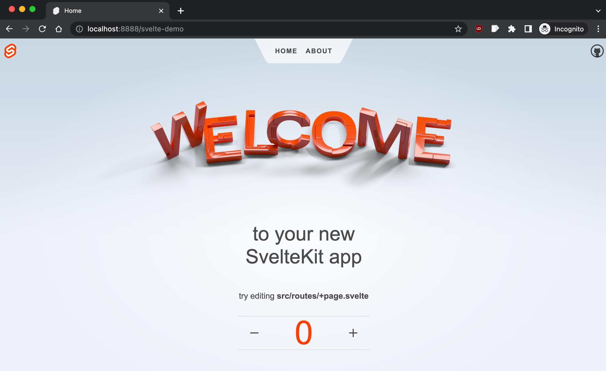

# svelte-demo

Example [SvelteKit](https://kit.svelte.dev/) SSR app that integrates with [DMT ENGINE](https://github.com/uniqpath/dmt).

```bash
cd ~/Desktop
git clone git@github.com:dmtsys/svelte-demo.git

cd svelte-demo
pnpm install

dmt integrate
```

Now open `localhost:8888/svelte-demo` (will move to port `:7777` a bit later).



